# CTI-HUB

<div align="center">

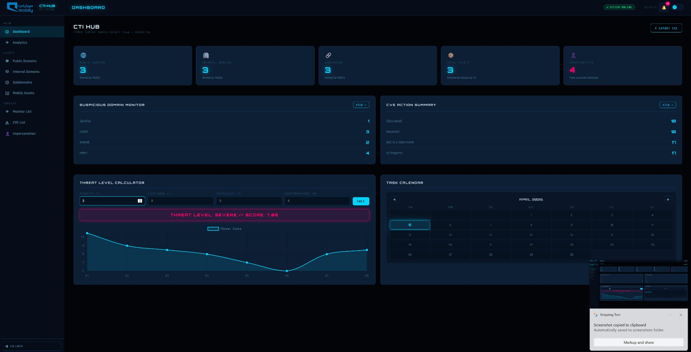

**A full-stack Cyber Threat Intelligence platform for brand protection, domain surveillance, CVE tracking, and impersonation detection.**

[](http://13.61.16.98)
[](https://python.org)
[](https://developer.mozilla.org/en-US/docs/Web/JavaScript)
[](https://aws.amazon.com)
[](https://nvd.nist.gov)

### 🌐 [Access Live Platform → http://13.61.16.98](http://13.61.16.98)

</div>

---

## Table of Contents

- [Overview](#overview)
- [Architecture](#architecture)
- [Features](#features)
  - [Dashboard](#1-dashboard)
  - [Public Domains](#2-public-domains)
  - [Internal Domains](#3-internal-domains)
  - [Subdomains](#4-subdomains)
  - [Asset Inventory](#5-asset-inventory)
  - [Suspicious Domain Monitor](#6-suspicious-domain-monitor)
  - [Domain Detail Panel](#7-domain-detail-panel)
  - [CVE Monitor List](#8-cve-monitor-list)
  - [Impersonation Accounts](#9-impersonation-accounts)
- [Tech Stack](#tech-stack)
- [Project Structure](#project-structure)
- [System Design](#system-design)
- [Getting Started](#getting-started)
- [API Reference](#api-reference)

---

## The Story Behind CTI-HUB

During my co-op placement at one of the largest telecom companies in the region, I had the opportunity to rotate across multiple divisions within the Cyber Security department — Penetration Testing, Vulnerability Assessment, the Security Operations Center, and finally the Cyber Threat Intelligence team, where I spent almost three months.

During my time with the CTI team, I noticed a pattern that kept slowing down the analysts: **information was everywhere except where it needed to be.** Domain ownership records lived in scattered spreadsheets. Asset inventories were incomplete or outdated. When a new CVE dropped, analysts had to manually browse the NVD website and cross-reference it with existing records to find out if it had already been reported. When a suspicious domain alert came in from a vendor like ZeroFox or Group-IB, closing that alert required manually querying five or six different tools — WHOIS, SSL checkers, DNS lookups, HTTP header inspectors, threat intelligence platforms — and piecing together the results by hand. A single domain investigation could take 15 to 30 minutes.

These weren't edge cases. This was the daily reality of the team.

I started small — building standalone Python scripts to solve individual problems. First a GitHub brand-mention dorking script to detect when the brand appeared on public repositories. Then a domain monitoring script to help triage the large volume of suspicious domains coming in from vendor alerts. Each script reduced manual work, but they were still isolated tools that lived on individual machines.

That's when I decided to build something bigger: a single unified dashboard that brings all of these capabilities together in one place, accessible to the entire team, running 24/7 on a live server. CTI-HUB is the result of that work.

## Overview

---

## Architecture

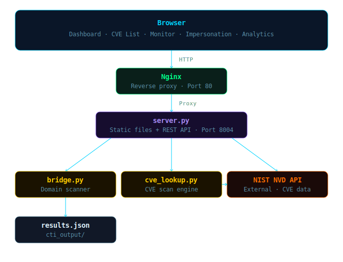

---

## Features

### 1. Dashboard


The main command center provides a complete real-time overview of the organization's threat landscape at a glance. Five stat cards at the top display live counts for Public Domains, Internal Domains, Subdomains, Total Assets, and Impersonation Accounts — each card links directly to its detail page.

Two summary panels run side by side beneath the stats. The **Suspicious Domain Monitor** panel categorizes incoming threat alerts by source — ZeroFox, OSINT, anomalies, and other feeds — giving analysts an instant picture of where threats are originating. The **CVE Action Summary** panel tracks vulnerability remediation status across four stages: Discovered, Reported, Not In Environment, and In Progress.

The **Threat Level Calculator** computes a standardized risk score using the formula `(Severity × Likelihood × Criticality) − Countermeasures` and renders the result with a color-coded severity label (Low through Severe), accompanied by a historical trend chart showing how the threat level has changed over time.

An interactive **Task Calendar** lets the team schedule and track investigation deadlines, reporting dates, and follow-up actions without leaving the platform.

---

### 2. Public Domains

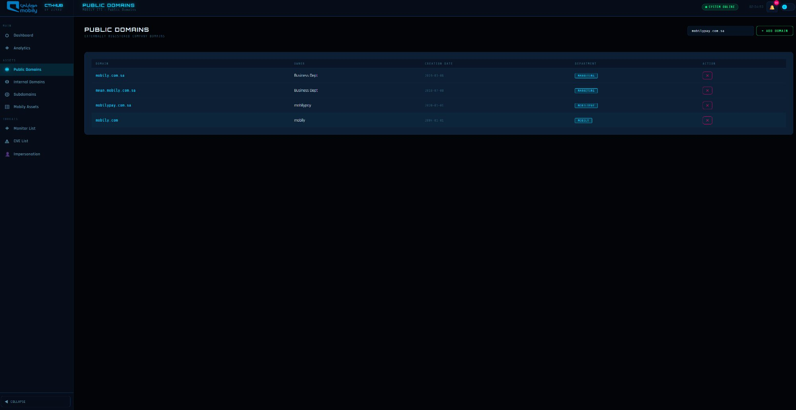

The Public Domains registry gives the CTI team authoritative visibility over every domain that is externally registered and publicly associated with the organization. Each entry records the domain name, owner, creation date, and responsible department.

This registry is the team's ground truth for domain ownership. Large organizations accumulate domains over time across different departments, subsidiaries, and projects — and without a centralized record, unauthorized or rogue domains can remain undetected for months. When a suspicious domain surfaces in a threat intelligence alert or external scan, analysts can immediately cross-reference it against this registry. Any domain that cannot be matched to an authorized entry is flagged for investigation and potential takedown action.

---

### 3. Internal Domains

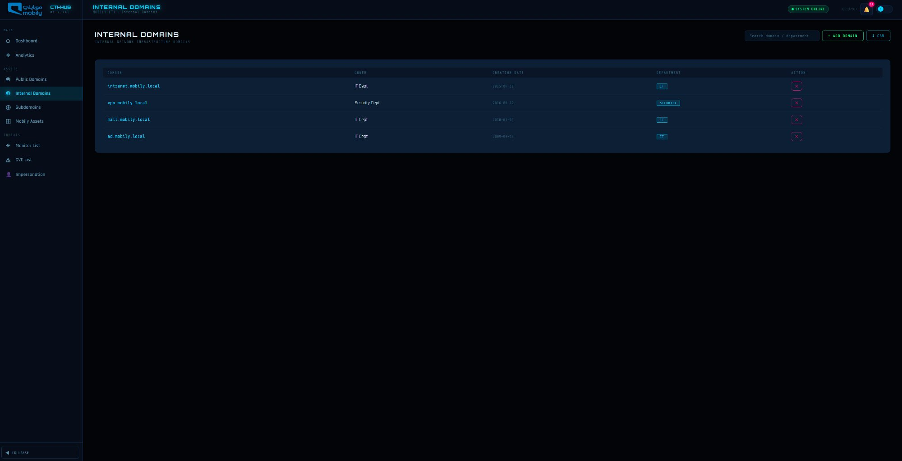

The Internal Domains page maintains a complete inventory of all internal network domains used within the organization's infrastructure — including intranet portals, VPN gateways, mail servers, and Active Directory endpoints. Each entry is tagged with its owner, creation date, and the department responsible for it.

While internal domains are not publicly accessible, tracking them is essential for understanding the full internal attack surface. During threat investigations — particularly insider threat cases or lateral movement analysis — analysts frequently need to verify whether a flagged domain belongs to internal infrastructure or represents something unauthorized. Having this registry immediately accessible within CTI-HUB eliminates the need to query IT teams or search through network documentation during time-sensitive investigations.

---

### 4. Subdomains

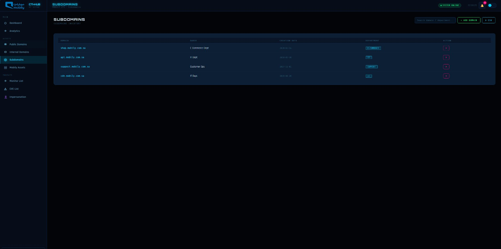

The Subdomains inventory tracks all enumerated subdomains operating under the organization's primary domains — including e-commerce storefronts, API endpoints, customer support portals, and CDN services. Each entry captures the subdomain, owner, creation date, and responsible department.

Subdomains represent one of the most exploited attack surfaces in modern threat campaigns. Forgotten subdomains, misconfigured DNS entries, and expired certificates can be taken over by threat actors and weaponized for phishing, credential harvesting, or malware distribution — all while appearing to come from a trusted organizational domain. By maintaining this complete inventory, the CTI team can immediately identify any subdomain appearing in threat intelligence feeds that does not belong to the authorized list.

---

### 5. Asset Inventory

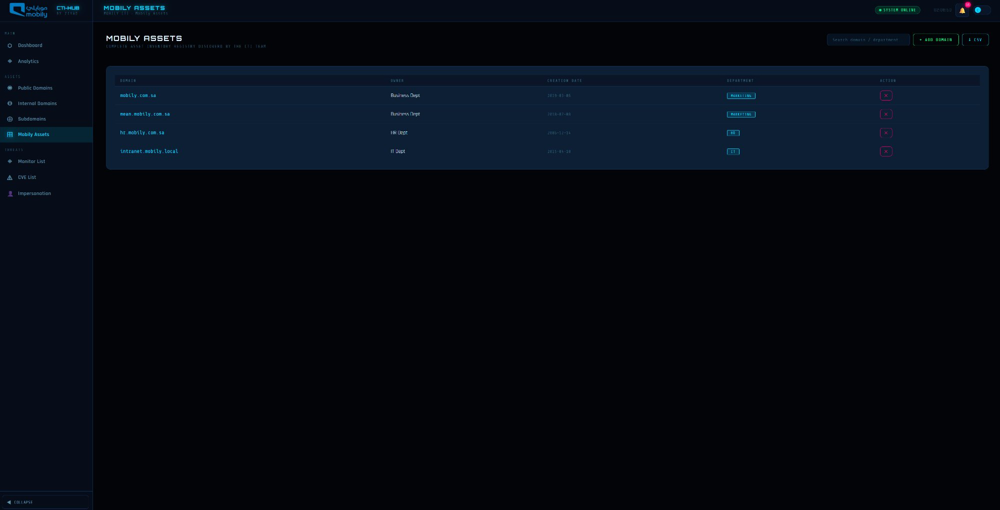

The Asset Inventory is a centralized registry for digital assets discovered by CTI team members in the course of their investigative work. Unlike the domain registries which track formally documented infrastructure, this page captures the broader set of assets that analysts encounter during threat hunting, OSINT research, and incident response — systems, services, and endpoints that may not be formally documented anywhere in the organization.

Large enterprises inherently suffer from asset visibility gaps. Teams grow rapidly, cloud resources are provisioned on demand, and new services go live faster than they can be catalogued through official IT processes. CTI analysts who encounter undiscovered assets now have a dedicated place to log them with owner, department, and discovery date. Over time, this builds a living picture of the organization's true digital footprint — one that reflects reality rather than what is officially documented.

---

### 6. Suspicious Domain Monitor

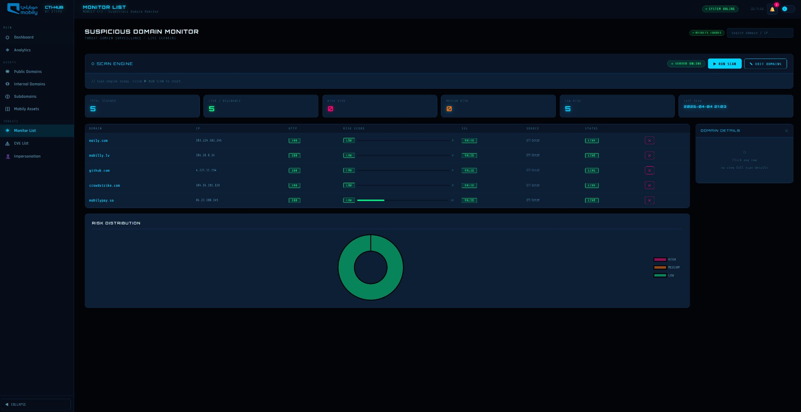

The Suspicious Domain Monitor is the platform's most operationally impactful feature. CTI teams routinely receive alerts from threat intelligence platforms, OSINT feeds, and partner organizations about domains that appear to be impersonating or targeting the organization. Before any alert can be formally closed, each domain must be thoroughly investigated — and doing that manually requires opening five or more separate tools, running individual queries, and manually synthesizing the results. That process takes between 15 and 30 minutes per domain.

CTI-HUB replaces this entire workflow with a single automated scan. The scan engine runs a comprehensive reconnaissance pass against every domain in the watchlist and returns a complete intelligence profile for each one in seconds. The results table displays each domain's resolved IP address, HTTP status, SSL validity, computed risk score, intelligence source, and current investigation status — all in a single view. A risk distribution chart at the bottom gives an immediate visual breakdown of HIGH, MEDIUM, and LOW risk domains across the entire watchlist.

---

### Scan Engine — Adding Domains

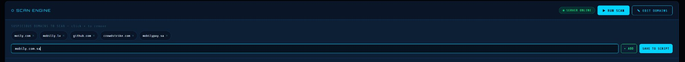

When a new suspicious domain alert arrives, analysts click **Edit Domains**, enter the domain in the input field, and click **Add**. The domain appears immediately as a removable pill tag. Multiple domains can be added in a single session. **Save to Script** writes the updated list directly to the scan engine — no file editing or terminal access required.

The entire process from receiving an alert to having a domain queued for automated investigation takes under 30 seconds.

---

### Scan Engine — Running

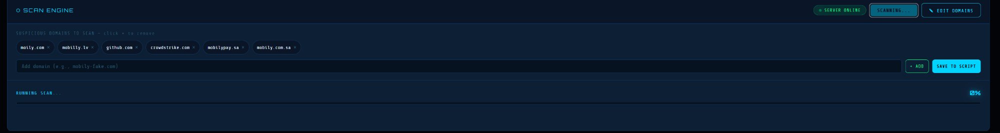

Clicking **Run Scan** launches the automated investigation server-side. A real-time progress bar advances domain by domain, with each domain pill changing color as the scan completes. Because the scan runs entirely on the server, analysts can freely navigate to other pages or continue other work without interrupting the process. Results are automatically loaded into the table when the scan finishes.

---

### 7. Domain Detail Panel

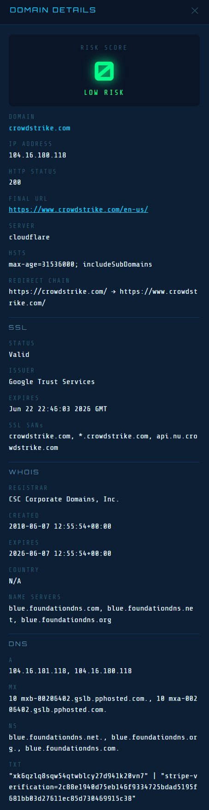

Clicking any domain in the results table opens the full Domain Detail Panel — a comprehensive automated intelligence report covering every dimension of the domain's technical profile:

- **IP Address** — the resolved hosting IP, useful for identifying shared infrastructure with other malicious domains
- **HTTP Status & Final URL** — whether the domain is live and what it resolves to, including server technology
- **HSTS Policy** — whether the domain enforces strict transport security, indicating a more sophisticated setup
- **Redirect Chain** — the complete sequence of redirects from the initial URL to its final destination, a common indicator of phishing infrastructure
- **SSL Certificate** — issuer, expiry date, and Subject Alternative Names, revealing whether a certificate was legitimately obtained or self-signed
- **WHOIS Data** — registrar, creation date, expiry date, and country of registration. A domain registered last week claiming to represent a long-established brand is an immediate red flag
- **DNS Records** — A, MX, NS, and TXT records, revealing the domain's mail server configuration, name servers, and any SPF or third-party verification tokens
- **Risk Score** — a computed score from 0 to 100 with a corresponding LOW / MEDIUM / HIGH classification

To gather this same information manually, an analyst would typically need to use at least five separate platforms: a WHOIS lookup service, an SSL certificate checker, a DNS query tool, an HTTP header inspector, and a threat intelligence platform such as VirusTotal or Shodan. That process takes 15 to 30 minutes per domain. CTI-HUB delivers the complete picture for every domain in the watchlist simultaneously, in seconds.

---

### 8. CVE Monitor List

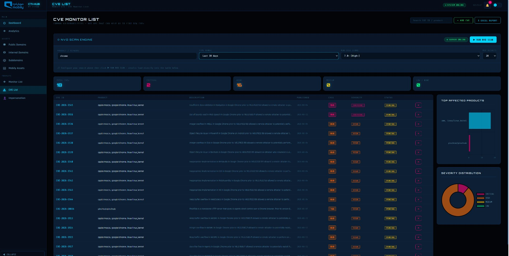

The CVE Monitor List connects directly to the NIST National Vulnerability Database API v2 and enables CTI analysts to discover newly published vulnerabilities with a single click. Rather than manually browsing NVD, subscribing to vendor advisories, or waiting for security bulletins, analysts can search by product name and retrieve a live, filtered list of relevant CVEs loaded directly into the platform.

In the example above, a search for Chrome over the last 30 days with a minimum CVSS score of 7.0 (High+) returned 18 results — 2 Critical and 16 High severity. Each entry displays the CVE ID, affected product and platform, a plain-language description, publication date, CVSS score badge, severity classification, and current action status. The **Top Affected Products** chart identifies which products are generating the most vulnerabilities, and the **Severity Distribution** donut provides an immediate risk profile breakdown.

Once loaded, analysts can update the status of each CVE to track remediation progress — Scanned, In Progress, Not In Environment, or Reported to Owner — and export the full list to a formatted Excel report with a single click.

---

### CVE Scan Parameters

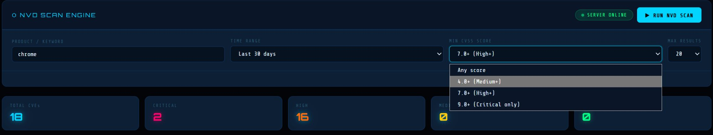

The NVD Scan Engine gives analysts precise control over their search through four parameters: the product or keyword, the time range (from the last 30 days up to all time), the minimum CVSS score threshold (Any Score, Medium+ 4.0, High+ 7.0, or Critical Only 9.0+), and the maximum number of results to retrieve.

This targeted search capability means that analysts monitoring a specific technology stack can run focused queries — for example, Critical-only Apache vulnerabilities from the last 90 days — and receive a concise, immediately actionable list. The scan queries the live NVD database server-side, so results always reflect the most current published vulnerability data rather than a cached snapshot.

---

### 9. Impersonation Accounts

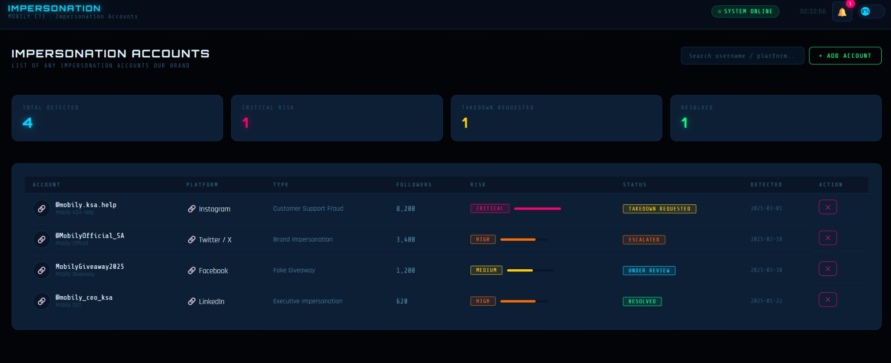

The Impersonation Accounts page is the team's central hub for tracking every fake or fraudulent social media account impersonating the brand. Brand impersonation is one of the most persistent threats organizations face — fake accounts are used to defraud customers, run phishing campaigns, spread misinformation, and erode brand trust. Without a dedicated tracking system, cases can be logged in scattered spreadsheets, forgotten in email threads, or lost between team members.

CTI-HUB consolidates all impersonation cases in one place. Each entry captures the account handle, display name, platform, impersonation type, follower count, risk level with a color-coded progress bar, current status, and date of detection. The summary strip at the top provides a management-level view: total accounts detected, Critical-risk count, active takedown requests, and resolved cases.

The risk bar visualization makes prioritization immediate — a Critical-risk account with 8,200 followers running a fake customer support operation demands different urgency than a Medium-risk fake giveaway page with 1,200 followers. With all cases visible in a single view, the team can ensure that nothing is missed and that high-priority takedown actions are escalated without delay.

---

### Adding an Impersonation Account

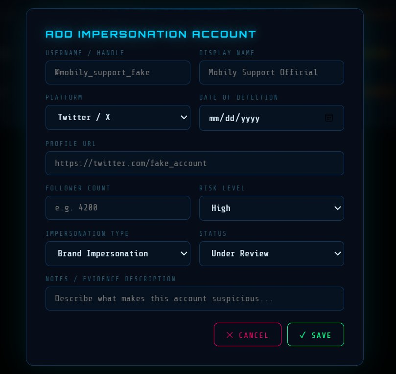

When a new fake account is discovered, analysts click **Add Account** to open the structured intake form. The form captures every detail required for investigation, reporting, and escalation: username and display name, platform, profile URL, detection date, follower count, risk level, impersonation type (Brand Impersonation, Customer Support Fraud, Fake Giveaway, Executive Impersonation, and more), current status, and a free-text evidence notes field.

Structured intake ensures that every case is logged consistently with sufficient detail for legal action, platform reporting, or management escalation — regardless of which team member files the report.

---

## Tech Stack

| Layer | Technology | Purpose |
|---|---|---|
| Frontend | HTML5, CSS3, Vanilla JS | UI and interactivity |
| Charts | Chart.js | All data visualizations |
| Fonts | Google Fonts | Orbitron, Rajdhani, Share Tech Mono |
| Backend | Python 3 (http.server) | File serving + REST API |
| CVE Data | NIST NVD API v2 | Live CVE lookup |
| Domain Intel | requests, dnspython, python-whois, tldextract | Domain reconnaissance |
| Excel Export | openpyxl | Report generation |
| Persistence | Browser localStorage | Client-side data storage |
| Reverse Proxy | Nginx | Production routing |
| Hosting | AWS EC2 t3.micro | Cloud deployment |

---

## Project Structure

```
cti-hub/
├── index.html                  # Dashboard entry point
├── server.py                   # Python backend + REST API
├── bridge.py                   # Domain surveillance scanner
├── cve_lookup.py               # Standalone CVE CLI tool
├── assets/
│   ├── css/shared.css          # Full design system
│   ├── js/shared.js            # DB, toast, notifications, export
│   ├── js/shell.js             # Sidebar + topbar injector
│   └── img/logo.png
├── pages/
│   ├── cve-list.html
│   ├── monitor-list.html
│   ├── impersonation.html
│   ├── analytics.html
│   ├── public-domains.html
│   ├── internal-domains.html
│   ├── subdomains.html
│   └── mobily-assets.html
└── cti_output/
    └── results.json
```

---

## System Design

### Domain Scan Flow

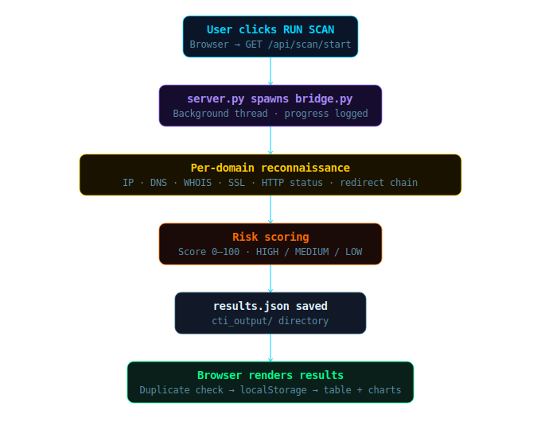

### CVE Scan Flow

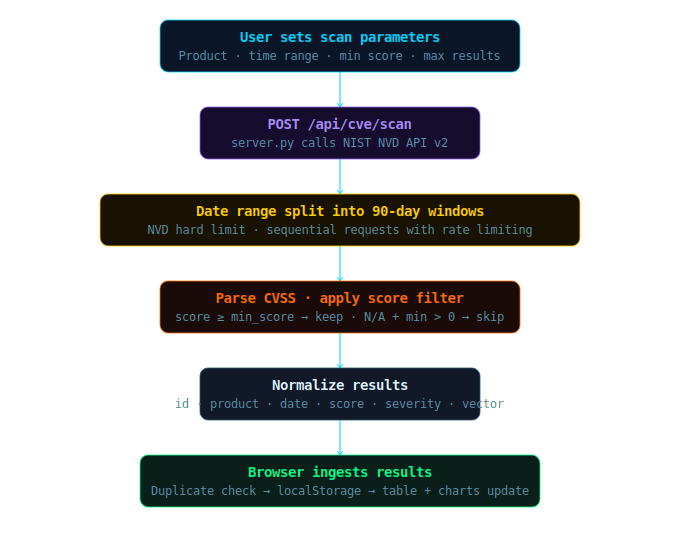

---

## Getting Started

### Local Development

```bash
pip install requests dnspython python-whois tldextract openpyxl reportlab Pillow

cd cti-hub
python server.py
```

Open `http://localhost:8004`

### CVE Lookup CLI

```bash
python cve_lookup.py
```

---

## API Reference

| Method | Endpoint | Description |
|---|---|---|
| `GET` | `/api/scan/start` | Start domain surveillance scan |
| `GET` | `/api/scan/status` | Poll scan progress |
| `GET` | `/api/results` | Fetch scan results |
| `GET` | `/api/domains/list` | Read domain watchlist |
| `POST` | `/api/domains/update` | Update domain watchlist |
| `POST` | `/api/cve/scan` | Run NVD CVE search |
| `POST` | `/api/cve/export-excel` | Generate Excel report |

---

## About

Built by **Ziyad Alshahrani** during a co-op placement in the Cyber Security Department of a major regional telecom company.

- Role: Digital Forensics and Incident Response Trainee
- Track: Software Engineering — Cyber Security
- University: Prince Sultan University, CCIS
- Rotations: Penetration Testing · Vulnerability Assessment · SOC · Cyber Threat Intelligence

CTI-HUB started as a collection of standalone Python automation scripts and grew into a full production platform after observing the daily challenges faced by the CTI team firsthand.

---

<div align="center">

🌐 **[http://13.61.16.98](http://13.61.16.98)**

</div>
